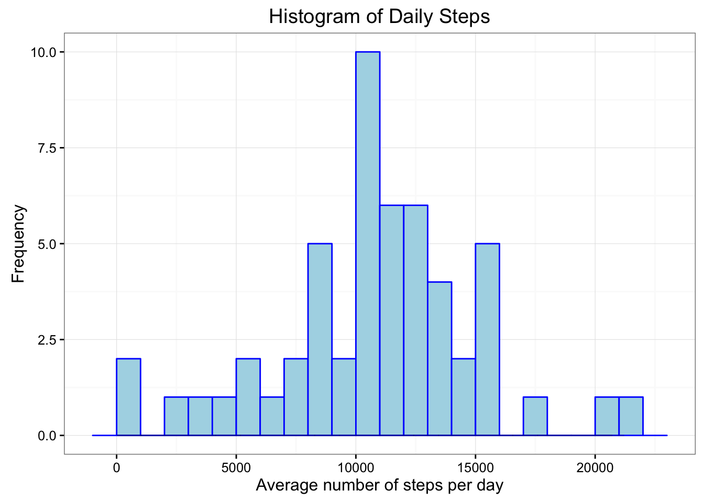
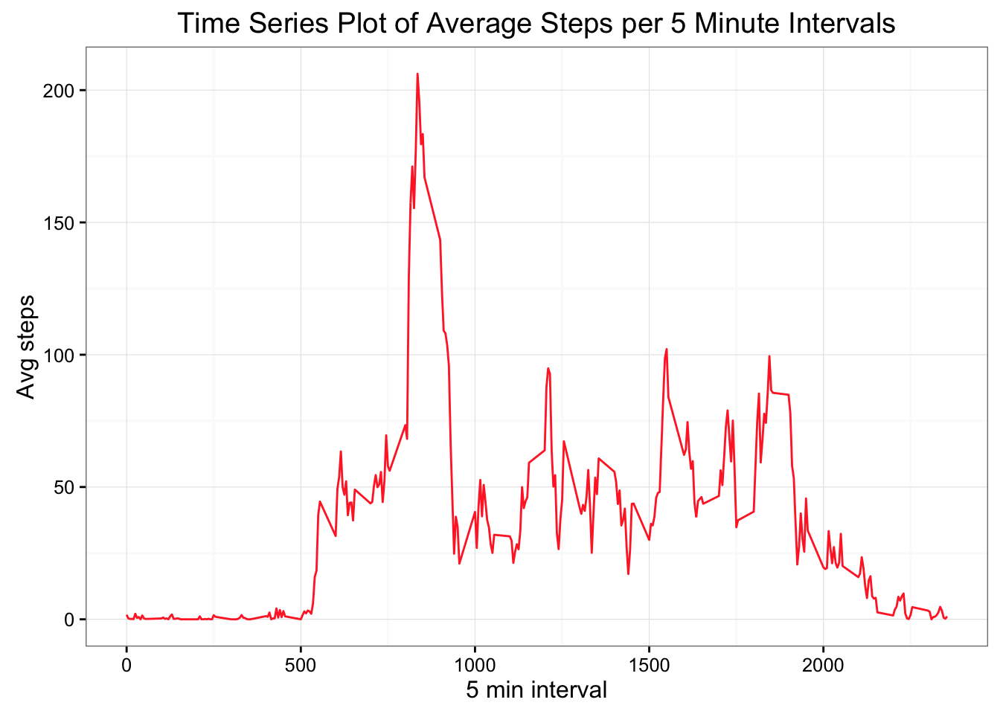
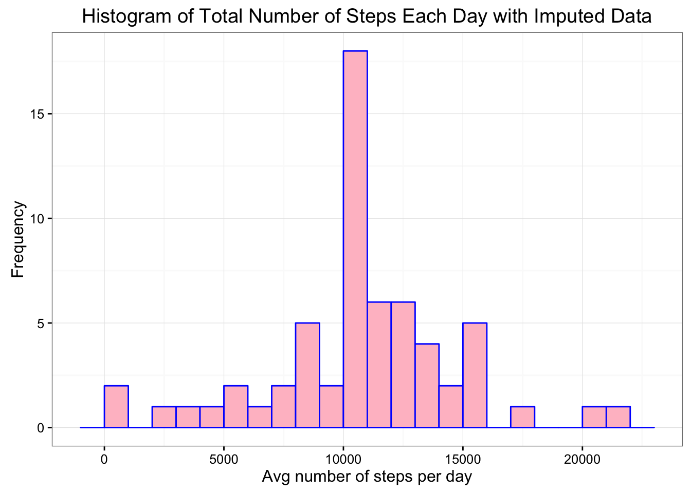
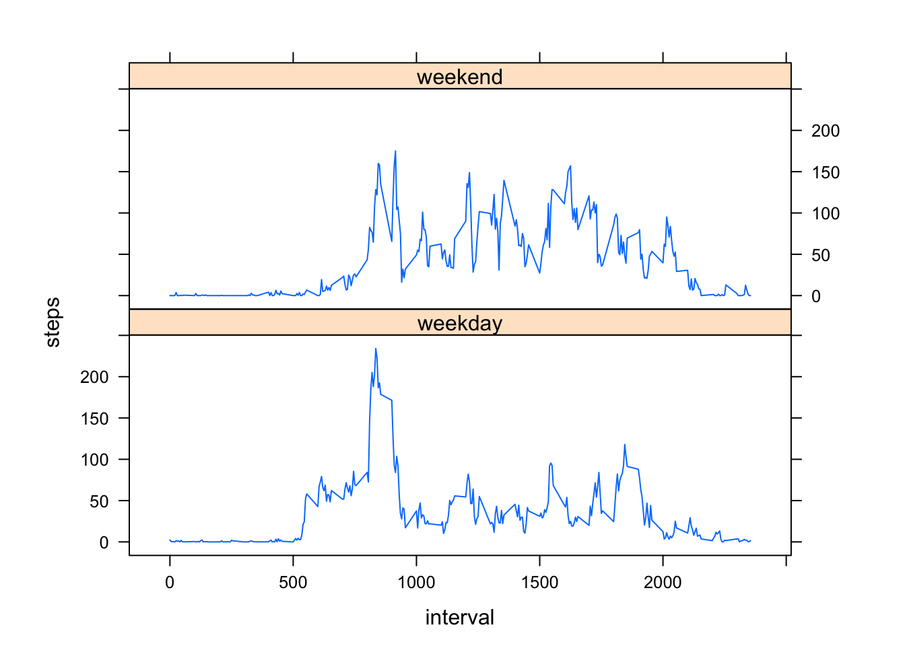

###**SECTION 1: Calculating and plotting the mean of the total number of steps per day**

**Step 1A: Load the data from the source file**


```r
activity <- read.csv(file="/Users/rebeccaweingarten/Desktop/R_working/Reproducible Research/Activity.csv", header = T)

# Convert date field from factor to date
activity$date <- as.Date(activity$date)

#Load Necessary Libraries 
## ("plyr", "lattice", "data.table", "httr", "ggplot2","reshape2")
```

**Step 1B Manipulate the data for plotting and analysis**


```r
library(plyr)
byday <- ddply(activity,"date", summarize, sum=sum(steps))

meanday <- round(mean(byday$sum,na.rm = TRUE))
medianday <- median(byday$sum,na.rm = TRUE)
```

**Step 1C Plot Daily Steps in Histogram Format**


```r
library(ggplot2)
ggplot(byday, aes(x=sum))+
  geom_histogram(colour= "blue", fill= "lightblue", 
  binwidth = 1000) +
  geom_density(alpha = .2) +
  labs(title= "Histogram of Daily Steps") +
  labs(x= "Average number of steps per day", y="Frequency") 
```

```
## Warning: Removed 8 rows containing non-finite values (stat_bin).
```

```
## Warning: Removed 8 rows containing non-finite values (stat_density).
```



**Step 1D Calculations for Mean and Median without NAs**

```r
paste("Mean Steps per Day =", meanday)
```

```
## [1] "Mean Steps per Day = 10766"
```

```r
paste("Median Steps per Day =", medianday)
```

```
## [1] "Median Steps per Day = 10765"
```

**Step 2A Plotting Average Daily Activity**

This will be a **time series plot** (i.e. 𝚝𝚢𝚙𝚎 = "𝚕") of the 5-minute interval (x-axis) and the average number of steps taken, averaged across all days (y-axis)


```r
library(plyr)
byinterval <- ddply(activity, "interval", summarize, avg=mean(steps, na.rm = T))

ggplot(byinterval, aes(x = interval, y = avg, group = 1))+
  geom_line(colour="firebrick1") +
  labs(title= "Time Series Plot of Average Steps per 5 Minute Intervals") +
  labs(x= "5 min interval", y = "Avg steps")
```



**Step 2B Finding Interval at which Max Average Number of Steps occurs**


```r
which.max(byinterval[,2])
```

```
## [1] 104
```

```r
maxinterval <- round(byinterval[104,])
intervalsort <- byinterval[order(byinterval[,2], decreasing = T),]

maxinterval
```

```
##     interval avg
## 104      835 206
```

The interval 835 has the highest count of steps, with 206 steps.


**Step 3A Inputting Missing Value**

**NOTE** There are a number of days/intervals where there are missing values (coded as 𝙽𝙰). The presence of missing days may introduce bias into some calculations or summaries of the data which is why I am going to input the NA data.

```r
missingvalues <- sum(is.na(activity))
missingvalues
```

```
## [1] 2304
```

```r
nrows <-nrow(activity)
nrows
```

```
## [1] 17568
```

```r
propmissing <-round(sum(is.na(activity))/nrow(activity)*100,1)
propmissing
```

```
## [1] 13.1
```

The total number of missing values is 2304 which is 13.1% of the total 17568 rows. To fill in the missing data I will update the NAs with mean of the 5-minute interval to not throw of the averages.

**Step 3B Creating New Data Set with NA values**

```r
library(Hmisc)
```

```
## 
## Attaching package: 'Hmisc'
```

```
## The following objects are masked from 'package:dplyr':
## 
##     combine, src, summarize
```

```
## The following objects are masked from 'package:plyr':
## 
##     is.discrete, summarize
```

```
## The following objects are masked from 'package:base':
## 
##     format.pval, round.POSIXt, trunc.POSIXt, units
```

```r
library(dplyr)
activity.imputed <- ddply(activity, "interval", mutate,
                          imputed.steps=impute(steps, mean))


act.imp.ordered <- activity.imputed[order(activity.imputed[,2],decreasing = FALSE),]

activity.imp<- act.imp.ordered[,c(4,2,3)]
activity.imp$imputed.steps<- as.integer(activity.imp$imputed.steps)

detach("package:Hmisc")
```

**Step 3C Histogram of the total number of steps taken each day with filled in data**


```r
byday.impute<-ddply(activity.imp,"date",summarize, sum=sum(imputed.steps))

ggplot(byday.impute,aes(x=sum)) + theme_set(theme_bw()) +
  geom_histogram(binwidth = 1000, colour="blue", fill="pink") +
  labs(title = "Histogram of Total Number of Steps Each Day with Imputed Data")+
  labs(x="Avg number of steps per day", y = "Frequency")
```




**Step 3D Calculate and Report the mean and median total number of steps**


```r
mean.impute <-round(mean(byday.impute$sum, na.rm = T))
median.impute <- median(byday.impute$sum, na.rm = T)

paste("Mean Steps per Day =", mean.impute)
```

```
## [1] "Mean Steps per Day = 10750"
```

```r
paste("Median Steps per Day =", median.impute)
```

```
## [1] "Median Steps per Day = 10641"
```

**Do these values differ from the estimates from the first part of the assignment? What is the impact of imputing missing data on the estimates of the total daily number of steps?**

Yes the mean and median differ when imputing missing data. The mean the first round was 10766 whereas the mean when imputing the mean into the NA data is 10750. The median for the first round was 10755 whereas the median when imputting the mean into the NA data is 10641.


**Step 4 Determine if there are differences in activity patterns between weekdays and weekends**


```r
library(dplyr)

activity.imputed$date <- as.Date(activity.imputed$date)
activity.imputed$dayname <- weekdays(activity.imputed$date)
activity.imputed$weekend <- as.factor(ifelse(activity.imputed$dayname == "Saturday" |
                      activity.imputed$dayname == "Sunday", "weekend", "weekday"))
```

**"Average Number of Steps per 5 minute interval (Weekend vs Weekday)"**


```r
library(lattice)
plotdata <- aggregate(steps ~ interval + weekend, activity.imputed, mean)
xyplot(steps ~ interval | factor(weekend), data=plotdata, aspect=1/3, type="l")
```



Note that the `echo = FALSE` parameter was added to the code chunk to prevent printing of the R code that generated the plot.
